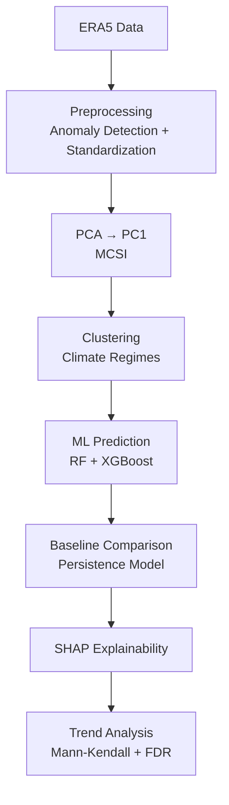

# 🌍 Global Compound Climate Risk Regimes (1990–2023)

### Detection, Predictability, and Attributable Drivers using ERA5 Surface Data

---

## 📌 Overview

This project presents a **data-driven framework** to analyze **global compound climate risk regimes** using ERA5 monthly surface reanalysis data from **1990 to 2023**.

Unlike traditional approaches that focus on single variables or isolated extreme events, this study identifies **recurring multivariate climate patterns (regimes)** by integrating multiple atmospheric variables into a unified analytical pipeline.

---

## 🎯 Objectives

- Identify **dominant global climate risk regimes**
- Develop a **data-driven multivariate climate index (MCSI)**
- Evaluate **predictability of regime transitions**
- Explain **key drivers using explainable AI (SHAP)**
- Detect **long-term trends and emerging hotspots**

---

## ❗ Research Gaps Addressed

| Gap in Previous Studies | Our Approach |
|------------------------|-------------|
| Manually weighted indices | PCA-based data-driven index (MCSI) |
| Regional or limited scope | Global analysis (1990–2023) |
| Limited variables | Integration of 6 surface climate variables |
| Event-based analysis | Regime-based clustering approach |
| No prediction benchmarking | ML models evaluated against persistence baseline |
| Black-box ML | SHAP-based explainability |
| Weak trend reliability | Mann-Kendall + FDR correction |
| Fragmented methodologies | Fully integrated analytical pipeline |

---

## 📊 Dataset

- **Source:** ERA5 Reanalysis (Copernicus Climate Data Store)  
- **Link:** https://cds.climate.copernicus.eu/  
- **Temporal Coverage:** 1990–2023  
- **Resolution:** Monthly averages  

### Variables Used:
- 2m Temperature (`t2m`)
- Total Precipitation (`tp`)
- Precipitation Rate (`avg_tprate`)
- Surface Solar Radiation (`ssr`)
- Total Cloud Cover (`tcc`)
- 10m Wind Speed (`si10`)

---

## ⚙️ Methodology

### 🔹 1. Preprocessing
- Convert raw data into **monthly anomalies**
- Standardize variables to ensure comparability

---

### 🔹 2. Multivariate Climate State Index (MCSI)
- Apply **Principal Component Analysis (PCA)**
- Extract **first principal component (PC1)** as the climate state index

---

### 🔹 3. Regime Detection (Unsupervised Learning)
- Algorithms used:
  - K-Means
  - Gaussian Mixture Model (GMM)
  - HDBSCAN
- Output: **Distinct climate regimes (clusters)**

---

### 🔹 4. Predictability Analysis (Supervised Learning)
- Models:
  - Random Forest
  - XGBoost
- Task: Predict **next-month climate regime**

#### Baseline:
- Persistence assumption (next state = current state)

#### Skill Score:

SS = (F1_ML − F1_persistence) / (1 − F1_persistence)

---

### 🔹 5. Explainable AI (SHAP)
- Quantifies contribution of each variable
- Provides **regional and seasonal interpretability**

---

### 🔹 6. Trend Analysis
- Mann-Kendall test for trend detection
- Sen’s slope for magnitude estimation
- Benjamini-Hochberg FDR correction (q < 0.10)

---

## 🔄 Workflow Pipeline

---

## 🌟 Key Contributions

- Fully **data-driven multivariate climate index**
- First **global surface-only regime framework at monthly scale**
- Integration of:
  - Regime detection
  - Predictability analysis
  - Explainable AI
  - Trend detection
- Statistically robust framework with **baseline benchmarking and FDR correction**

---

## 📈 Expected Outcomes

- Identification of **global climate risk regimes**
- Improved understanding of **compound climate interactions**
- Insights into **predictability of climate patterns**
- Detection of **emerging climate risk hotspots**

---

## ⚠️ Limitations

- Monthly resolution does not capture short-term extreme events
- PCA reduces dimensional complexity (possible information loss)
- SHAP sensitivity to correlated variables

---

## 📚 References

- Hersbach et al. (2023) – ERA5 dataset  
- Zscheischler et al. (2020) – Compound climate events  
- Michelangeli et al. (1995) – Weather regimes  
- Bevacqua et al. (2021) – Compound event guidelines  
- Zhang et al. (2024) – Explainable AI in climate science  

---

## 🚀 Future Work

- Extend analysis to **daily-scale extreme events**
- Incorporate **higher-order PCA components**
- Explore **deep learning approaches**
- Apply framework to **regional impact assessments**

---

## 🤝 Contributions

Contributions, suggestions, and collaborations are welcome.

---

## 📬 Contact

- **Name:** SADIA AFRIN ANIKA
- **Email:** anikasadia2723@gmail.com  

---

⭐ If you find this project useful, consider giving it a star!
